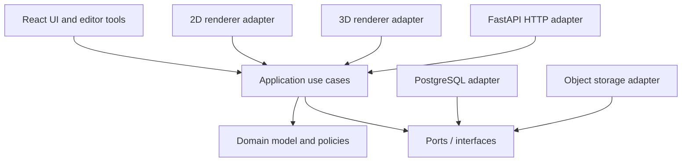

# Architecture Plan

## 1. Architectural goals

The system should be easy to extend without turning the room model into a Three.js scene or making the editor UI responsible for business rules. It should support homeowners first and provide a safe foundation for professional catalogues, customer projects, quotations, collaboration, and AI-assisted planning.

The design follows a **ports and adapters / clean architecture** structure:



Arrows represent dependency direction: outer components depend on inner contracts. The domain has no dependency on frameworks, rendering engines, databases, HTTP, or AI providers.

## 2. Technology baseline

| Concern | Initial choice | Boundary |
|---|---|---|
| Web UI | React + TypeScript + Vite | Presentation only |
| 2D editor | Konva.js | `PlanRenderer` adapter |
| 3D preview | Three.js + React Three Fiber | `SceneRenderer` adapter |
| API | FastAPI + Pydantic | HTTP adapter and DTO validation |
| Database | PostgreSQL + SQLAlchemy + Alembic | Persistence adapter |
| File assets | S3-compatible object storage | `AssetStore` adapter |
| Web tests | Vitest, React Testing Library, Playwright | Unit, component, and end-to-end checks |
| API tests | pytest | Domain, use-case, contract, and integration checks |

This is a modular monolith initially. Keep clear internal module boundaries; split services only when operational or team needs justify the extra distributed-system cost.

## 3. Layer responsibilities

### Domain (`packages/domain` and API-side domain package)

Owns the product concepts and invariants:

- `Project`, `Room`, `Wall`, `Opening`, `PlacedProduct`, `MaterialAssignment`.
- Value objects such as `LengthMm`, `PointMm`, `Rotation`, `RoomId`, and `ProductId`.
- Rules such as valid dimensions, non-overlapping openings on a wall, fixture clearance checks, and valid attachment to a wall/floor.
- Domain policies for geometry validation and product fit.
- Domain events such as `ProductPlaced` or `RoomDimensionsChanged` where they provide useful integration seams.

Represent authoritative dimensions as integer millimetres. Convert to metres only at the 3D adapter boundary. This avoids floating point drift in editing and persistence. Use explicit coordinate conventions: plan X/Y in millimetres, floor elevation Z in millimetres; renderer maps plan Y to world Z and elevation to world Y.

Domain objects should be small and cohesive. Avoid a generic `RoomManager` or `DesignService` that accumulates unrelated rules. Put behavior next to the entity/value object that owns the invariant, or in a named domain policy when the rule spans multiple entities.

### Application (`packages/application`)

Coordinates one user goal at a time. Use cases own the workflow, transaction boundary, authorization check, and port calls. Examples:

- `CreateProject`
- `UpdateRoomDimensions`
- `AddOpening`
- `PlaceProduct`
- `MoveProduct`
- `AssignMaterial`
- `UndoDesignChange` / `RedoDesignChange`
- `LoadProject` / `SaveProject`
- `ExportDesignSnapshot`

Each command is validated before mutation. A use case returns a typed result with either a new immutable design snapshot and emitted events, or structured validation errors. Use cases do not import UI or rendering packages.

### Presentation (`apps/web`)

Owns route/page composition, panels, toolbars, dialogs, accessibility, and input collection. Components should be focused and composed by feature (project setup, room editor, catalogue, materials, sharing). Components call application-facing hooks/controllers and display returned state. Keep calculation rules out of components and avoid a single editor component containing every mode and panel.

The front end maintains transient interaction state separately from saved design state: current tool, hover target, selection, camera position, open panels, and drag preview. Only committed design changes become application commands.

### Rendering adapters (`renderer-2d`, `renderer-3d`)

Convert an immutable `DesignSnapshot` plus transient viewport state into pixels. They do not create canonical product records, write to persistence, or apply design mutations directly. Pointer/keyboard gestures are translated into semantic intents (select, request move, request resize) that the application validates.

### API and infrastructure (`apps/api`, `adapters`)

FastAPI routers translate HTTP requests into application commands and application results into response DTOs. SQLAlchemy models and repository implementations live in infrastructure; map between persistence records and domain data explicitly. Object storage handles binary assets only; metadata and access rules remain in the application/domain and database.

## 4. Interfaces and dependency boundaries

Define behavior as small interfaces at the point of use. Use TypeScript interfaces for web/application ports and Python `Protocol` or abstract base classes for API-side ports. Keep interfaces capability-based; do not make every class implement one broad `IService`.

### Example application ports

```ts
export interface ProjectRepository {
  get(projectId: ProjectId, actorId: UserId): Promise<DesignSnapshot | null>;
  save(snapshot: DesignSnapshot, expectedRevision: number): Promise<SaveResult>;
}

export interface ProductCatalog {
  get(productId: ProductId): Promise<CatalogProduct | null>;
  search(query: ProductSearch): Promise<readonly CatalogProduct[]>;
}

export interface DesignCommandBus {
  execute(command: DesignCommand): Promise<CommandResult>;
}

export interface AssetStore {
  createUploadTarget(input: AssetUploadRequest): Promise<UploadTarget>;
  resolve(assetId: AssetId): Promise<AssetReference | null>;
}
```

Use small ports such as `ProjectRepository`, `ProductCatalog`, `AssetStore`, `Clock`, `IdGenerator`, and `AuthorizationPolicy`. A renderer contract should describe what it needs and emits, for example `PlanRenderer.render(snapshot, viewport)` and a stream of semantic `EditorIntent`s. Keep rendering-engine-specific values (Three.js `Object3D`, Konva nodes, GPU resources) inside their adapters.

### Dependency rules

1. Domain depends only on language/runtime primitives and other domain modules.
2. Application depends on domain and its own port definitions.
3. UI and renderer adapters depend on application/domain contracts, never the reverse.
4. Infrastructure implements application ports.
5. Composition roots (`apps/web` bootstrap and FastAPI startup) choose concrete adapters and wire dependencies.
6. No module reaches into another module's private implementation; expose public contracts through its index/package API.

## 5. Front-end component and state split

Suggested feature tree:

```text
apps/web/src/
  app/                 routes, providers, dependency composition
  features/
    project/            list, create, save, share
    editor/
      shell/             editor layout and panels
      tools/             select, draw wall, place, measure
      state/             editor session and transient state
      commands/          UI command dispatch and undo stack view
    catalogue/           product search and product cards
    materials/           finish selection
  shared/
    ui/                  buttons, dialogs, accessible controls
    api/                 HTTP client and transport DTOs
  adapters/
    renderer-2d/
    renderer-3d/
```

Keep these states distinct:

- **Persisted design state:** versioned, serializable, domain-validated.
- **Editor session state:** selected entity, active tool, hover, drag preview; not saved as part of the design unless explicitly user-facing.
- **Viewport state:** camera, zoom, pan, render quality; optionally saved as a view preference, never mixed into geometry.
- **Remote state:** projects/catalogue/API results, managed through a query/cache layer behind a repository adapter.

For manipulation, use a preview/commit flow: pointer movement updates only a transient preview; pointer release emits one semantic command; the command is validated and committed once. This prevents hundreds of database or history writes during a drag.

## 6. Rendering practices

- Keep the design snapshot as the single source of truth; the scene graph is a derived view.
- Use stable entity IDs as renderer keys. Never identify a product by its array index or mesh instance.
- Separate world geometry from camera, selection outlines, gizmos, dimension labels, and other overlays.
- Use a small number of reusable geometry/material resources; instance repeated catalogue items where appropriate.
- Cache loaded models/textures by asset identity and explicitly dispose GPU resources when an asset is evicted or an editor session ends.
- Avoid creating geometries, materials, or callbacks on every frame. Use memoized resources and update transforms only for changed entities.
- Keep render loops free of application/network calls and expensive geometry solving. Perform derived calculations when the snapshot changes; move large pure calculations to a worker if profiling demonstrates need.
- Prefer demand-based rendering for a mostly static room, with continuous frames only during camera movement, animation, or interaction.
- Use a staged quality policy: fast editor preview first; optional higher-quality export/render later.
- Use physically meaningful units and predictable lighting/material conventions. Keep product dimensions and pivot/origin rules in catalogue metadata.
- Establish practical budgets for model polygon count, texture dimensions, draw calls, and load size; validate catalogue assets at ingestion.
- Provide a 2D fallback and keyboard-accessible controls for core edits; do not make 3D drag the only way to position an item.
- Add visual regression tests only around stable, high-value views; test geometric correctness primarily through domain tests.

## 7. Design data and API

### Canonical design snapshot

Persist a versioned document with IDs, integer millimetre dimensions, coordinates, product references, material references, and explicit placements. Store catalogue product metadata separately from project placements. A project references a product/version plus placement transform; it should not embed a mutable vendor product record.

Include:

- `schemaVersion`, project ID, revision, timestamps, owner/workspace ID.
- Room dimensions, wall segments, openings, and level/floor reference.
- Product placements with stable IDs, anchor/surface, transform, orientation, and optional variant.
- Material/finish assignments by surface or product.
- View preferences only where user value justifies saving them.

### API shape (initial)

- `POST /v1/projects` create project.
- `GET /v1/projects/{id}` load snapshot and revision.
- `PUT /v1/projects/{id}` save with an expected revision / ETag to avoid lost updates.
- `GET /v1/catalogue/products` search/filter catalogue.
- `POST /v1/assets/upload-target` request a time-limited upload target.

Validate input at three levels: transport schema, application authorization/workflow, and domain invariants. The API must not accept arbitrary scene graphs or unchecked renderer JSON.

## 8. SOLID applied in this product

- **Single Responsibility:** room geometry validation, product search, scene projection, and HTTP mapping have distinct owners.
- **Open/Closed:** new fixture types or render adapters extend typed contracts and registries rather than adding conditionals across the whole editor.
- **Liskov Substitution:** adapters obey their declared port behavior, including errors, ordering, idempotency, and nullability.
- **Interface Segregation:** consumers depend on narrow ports such as read-only `ProductCatalog` rather than a broad service with unrelated write operations.
- **Dependency Inversion:** use cases depend on repository/catalogue interfaces; composition roots provide PostgreSQL, object storage, and rendering implementations.

SOLID is a design aid, not a requirement to create an interface for every class. Create an interface where it isolates a changeable or external behavior, defines a useful test seam, or lets a consumer depend on less.

## 9. Testing and quality gates

| Level | What to verify | Examples |
|---|---|---|
| Domain unit | Invariants and deterministic calculations | placement bounds, opening fit, clearances |
| Application unit | Use-case orchestration using fake ports | authorization, conflicts, save behavior |
| Contract | Port and API schema behavior | repository revisions, command results, DTO compatibility |
| Adapter integration | Real database/storage/render adapter seams | migrations, mapping, upload target behavior |
| UI component | Accessible interaction and intent dispatch | tool selection, validation display |
| End-to-end | Main user journey | create room, place fixture, save, reopen, export |
| Rendering | Stable projection and lifecycle behavior | basic bounds, cleanup, important screenshot baselines |

Add linting, TypeScript strict mode, Python type checks, formatting, dependency-boundary checks, and CI on each pull request. Avoid testing implementation details when behavior can be tested through public contracts.

## 10. Security and operational concerns

- Enforce project ownership/workspace permissions in application use cases, not only in UI hiding.
- Validate and normalize uploaded GLB/glTF, image, and texture assets; apply size/type limits and malware scanning if public uploads are enabled.
- Use signed, short-lived object-storage upload/download URLs.
- Use optimistic concurrency for saves and append-only audit information for important company actions.
- Keep secrets server-side; never ship database/storage credentials to the browser.
- Add structured logs, request IDs, error reporting, and basic metrics before multi-company rollout.
- Treat AI output, imported project files, and third-party catalogue metadata as untrusted input.

## 11. Delivery phases

### Phase 0 — Product and geometry decisions

Define supported room shapes, coordinate conventions, first user journey, persistence rules, and fixture placement semantics. Record key choices as ADRs.

### Phase 1 — Domain and 2D vertical slice

Implement project/room model, validation, command results, undoable mutations, room outline, openings, product placement, and a local project repository. Prove the model without 3D.

### Phase 2 — 3D preview and serialization

Project the same snapshot into Three.js, add catalogue asset loading, camera controls, material preview, versioned save/load, and migration tests.

### Phase 3 — API and persistent projects

Add FastAPI, PostgreSQL, authentication/authorization integration, revision-safe saves, catalogue endpoints, and asset storage adapter.

### Phase 4 — Professional workflows

Add company workspaces, customer projects, product variants/pricing, quotation/export, sharing, and audit history behind application ports.

### Phase 5 — AI assistance

Add AI as a planner that proposes typed commands against a bounded design snapshot. Reuse validation, authorization, history, and rendering paths already built for human edits.

## 12. Architecture decision records

Create short ADRs in `docs/adr/` for changes that affect boundaries or migration cost. Initial candidates:

- ADR 0001: modular monolith and ports/adapters.
- ADR 0002: canonical integer millimetre coordinate model.
- ADR 0003: Konva and Three.js adapter contracts.
- ADR 0004: versioned design document and optimistic concurrency.
- ADR 0005: AI suggestions expressed as validated commands.
